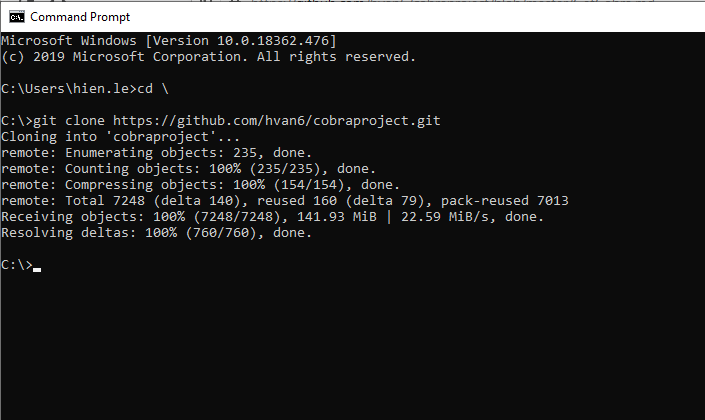
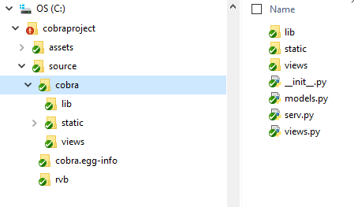

# GET COBRA to local
How to install and setup code.

**Requirement**:
* Windows OS (10 or server 2016)
* Python >=3.7.5
* Internet

​

These steps will get COBRA installed and running:
​
* Clone COBRA GitHub repository:
​

  `git clone https://github.com/hvan6/cobraproject.git`  

  
  {:height="360px" width="480px"}

  Recommend clone to c:\cobraproject. Make sure the project has the following structure.  

  

* COBRA env directory path setting:

	Make sure `set VENV=C:\cobraproject\env` at first line in both `C:\cobraproject\source\firstRun.bat` and `C:\cobraproject\source\run.bat`.

  If cobraproject is cloned to another directory different with c:\, please update VENV path to the correct path to the directory of your local COBRA
​
* Unzip dataset:

  Unzip C:\cobraproject\source\cobra\static\properties_2017_cleaned10-30.zip to C:\cobraproject\source\cobra\static\properties_2017_cleaned10-30.csv

* Start the development server:
​
  * If it is the first time execution, double click on `firstRun.bat` to install environment packages and compile project, do **NOT** close command prompt window

  * Otherwise, double click on `run.bat` to compile project, do **NOT** close command prompt window
​
* Open a browser and navigate to: http://localhost:6543/
